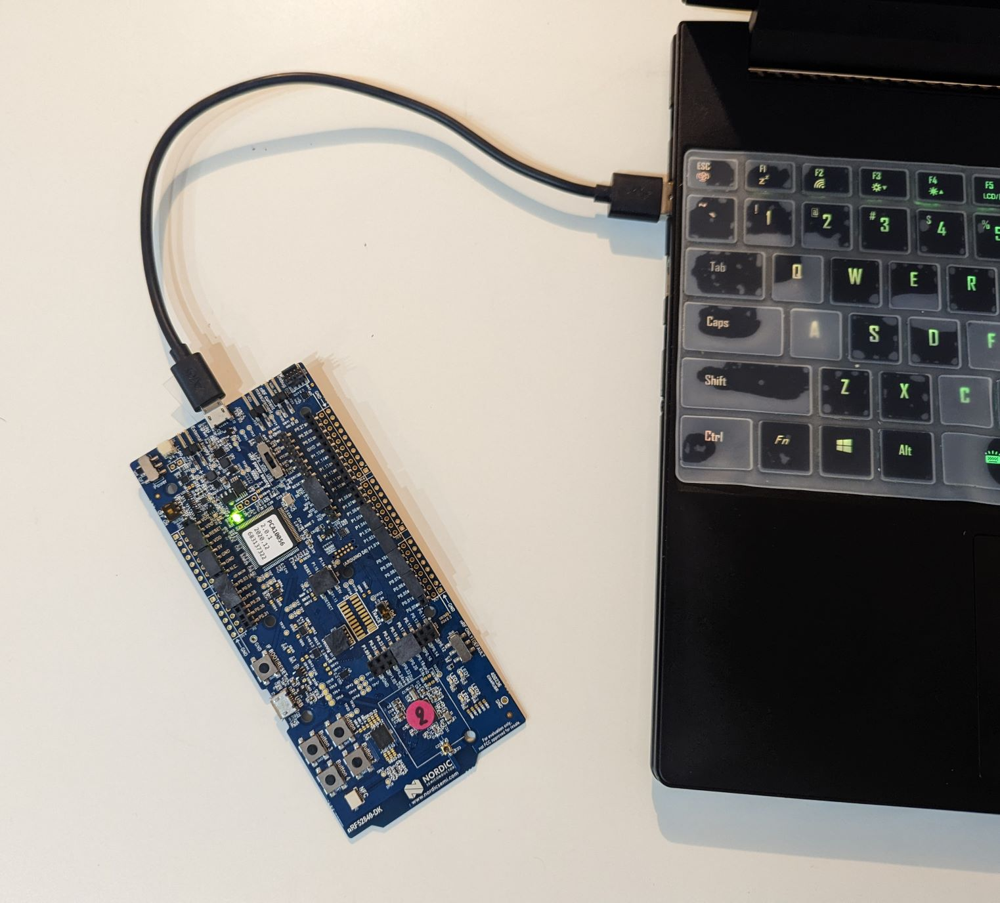
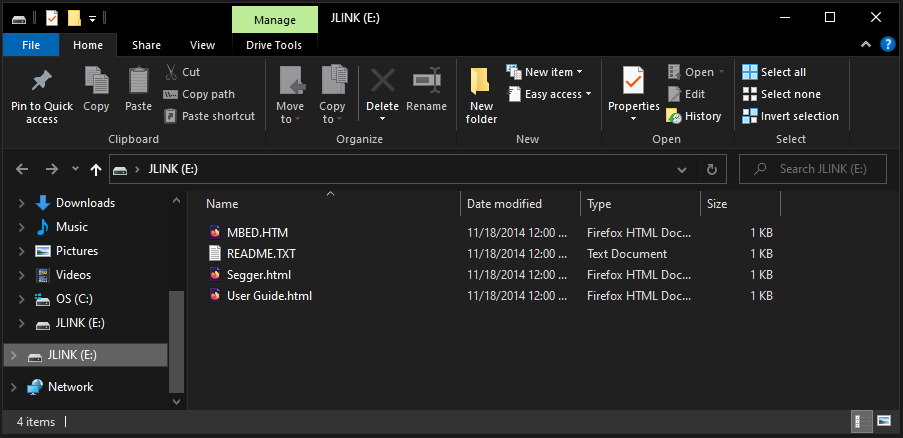
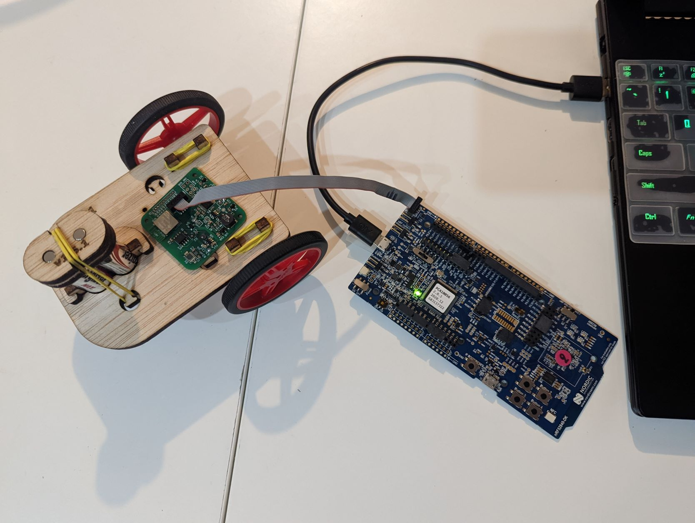

# DotBot main app

  

This repository contains the source code for the DotBot's firmware.

Loading this app onto the DotBot board will make the motors of the DotBot remote controllable by a nRF52840-DK with the [gateway-firmware](https://github.com/DotBots/Gateway-firmware-fresh/releases) firmware, as it can be seen in the above video.

## Getting Started

The following instructions will guide through running the default remote control example in your DotBot board.

### Materials

- 1x DotBot board
- 1x nRF52840-DK development board
- 1x 10pin IDC programming cable
- 1x micro USB able

### Download the firmware onto the boards

1. Download the lastest releases (the .hex files) of the DotBot-firmware and of the Gateway firmware 

	- __DotBot Firmware__:  [Link](https://github.com/DotBots/DotBot-firmware-fresh/releases)
	- __Gateway Firmware__: [Link](https://github.com/DotBots/Gateway-firmware-fresh/releases)

You should end up with 2 files named `DotBot-firmware-fresh_REL-XYZ.hex` and `Gateway-firmware-fresh_REL-XYZ.hex`. Where `XYZ` is the number of the release

2. Connect the nRF52840-DK to your computer through the micro USB cable

  

  
  - A USB drive called  __JLINK__ should appear on your computer. 

  

3. Drag-&-Drop the Gateway firmware executable `Gateway-firmware-fresh_REL-XYZ.hex` into the JLINK folder to program the development board.

4. Connect the nRF52840-DK to the DotBot through the 10 pin IDC cable.
  - Make sure the DotBot is turned ON and has full batteries installed.

  

5. Drag-&-Drop the DotBot firmware executable `DotBot-firmware-fresh_REL-XYZ.hex` into the JLINK folder to program the DotBot.

6. Disconnect the DotBot from the nRF53840-DK

### Controlling the DotBot

  

At this point you should be able to control the movement of the DotBot using the buttons on the nRF52840-DK, the controls are as follows:
- __Button 1__: Forward
- __Button 2__: Turn Right
- __Button 3__: Turn Left
- __Button 4__: Backward

## Accessing the source code

The source code of the remote control example of the DotBot can be found in `projects/03app_dotbot/03app_dotbot.c`.
