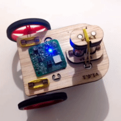

# RGB LED usage example

## Introduction

  

Loading this example into the DotBot board will cause the LED to slowly cycle through several colors, as it can be seen in the above video.

This example uses the SPIM peripheral to interface with the RGB LED in the DotBot board, by means of the TLC5973D 1-wire RGB LED driver.