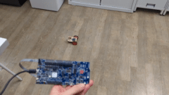

# DotBot main app

## Introduction

  

Loading this app onto the DotBot board will make the motors of the DotBot remote controllable by a nRF52840-DK with the [gateway-firmware](https://github.com/DotBots/Gateway-firmware-fresh/releases) firmware, as it can be seen in the above video.

