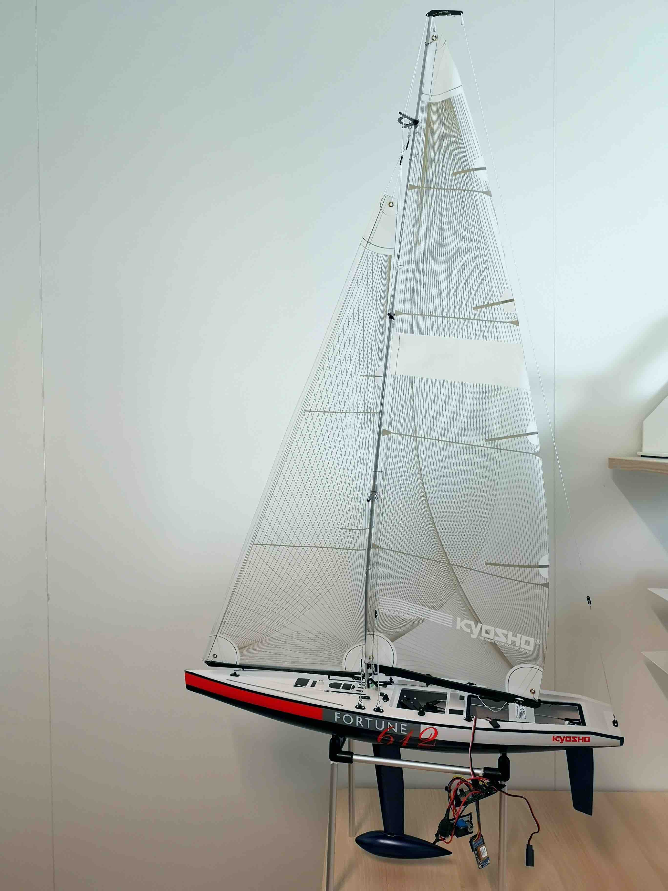

# SailBot main application

  

This app contains the main firmware of the SailBot platform based on Kyosho's Fortune 612 chassis. The app reuses the low-level libraries from the DotBot repository.

## Instructions

1. Load this app on the SailBot board.
1. Program an nRF52840-DK with [gateway firmware](https://github.com/DotBots/DotBot-firmware/tree/03app_dotbot_gateway).
1. Start [BotController-python](https://github.com/DotBots/BotController-python)on your computer.
