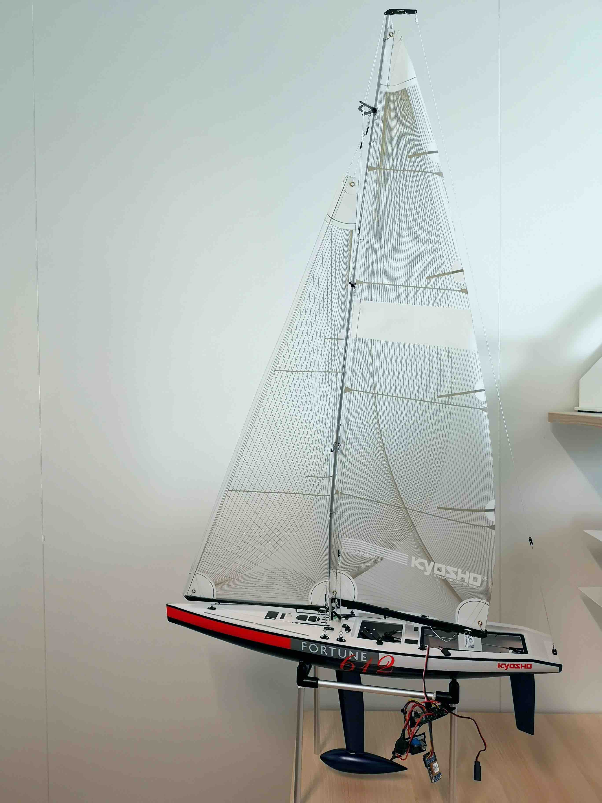

# SailBot main application

This app contains the main firmware of the SailBot platform based on Kyosho's Fortune 612 chassis. The app reuses the low-level libraries from the DotBot repository.

## Instructions

1. Load this app on the SailBot board.
1. Program an nRF52840-DK with [long range gateway firmware](https://github.com/DotBots/DotBot-firmware/tree/main/projects/dotbot_gateway_lr).
1. Start [DotBot controller](https://github.com/DotBots/PyDotBot)on your computer.
