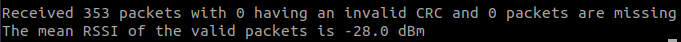

# GOAL: Check the radio communication between two nRF boards

## Segger:
  * **UnZIP** then open `DotBot-firmware` file and open project called `nRF52840dk` with Segger
  * Line 23 of each code you can choose the mode you want: BLE, 802.15.4 for Tx and RX /  Tone,BLE, 802.15.4 for the Blocker
  * Tx: **build** then **load** `solution Radio test -> project 'Tx'` on the first nRF
  * Rx: **build** then **load** `solution Radio test -> project 'Rx'` on the second nRF (you can change the power for your test line 109)
  * Blocker: **build** then **load** `solution Radio test -> project 'Blocker'` on the third nRF (you can change the power for your test line 114)
  * **Link** `pin 0.08` from the TX to `pin 0.07` from blocker

  
    
 ## Python:
  * **install** serial package `pip install pyserial`
  * **install** pydotbot package `pip install pydotbot`
  * **find** the port of your nRF where the RX code is loaded
  * With a text file editor **change** the serialport_rx with the right one
  * **Launch** the script: `dist/scripts/radio_test/radio_test.py`
  * **Follow** the script indication
  * You can end the script by pressing CTRL+C and it will show you the data you ask for

  
  
