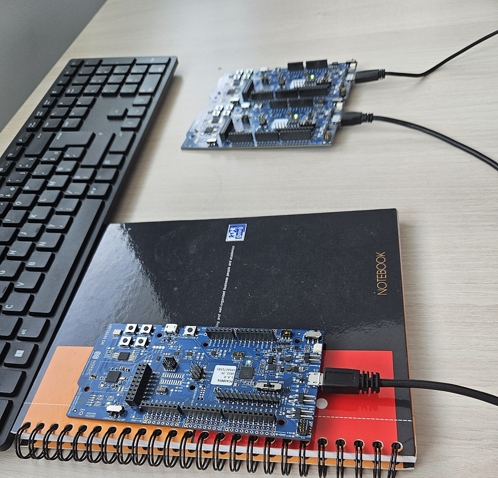

## GOAL: Check the radio communication between two nRF52840DK

### Segger:
  * **UnZIP** then open `DotBot-firmware` file and open project called `nRF52840dk` with Segger
  * Tx: **build** then **load** `projects_radio_test -> project Tx` on the first nRF
  * Rx: **build** then **load** `projects_radio_test -> project Rx` on the second nRF
  * Tx_Idle: **build** then **load** `projects_radio_test -> project TxIdle` on the third nRF (you can change the power for your test)

  
    
 ### Python /Conda:
  * **download** and **install** Anaconda 
  * **download** in the python file in **dist/scripts/radio_test**
  * With Conda: `conda install anaconda::pyserial` (go next if already done)
  * With **cd** command go to directory where you have downloaded /move the python file (use TAB to help fill the mane of directory and **dir** (on windows) / **ls** (linux) to know the list files on the directory)
  * With the peripheral manage **find** the COM of your nRF with the RX code
  * With text file editor **change** the COM  with the write one
  * **Launch** the script: _python test_radio.py_
  * The script will end when you disconnect the nRF with the Rx code and give you the result of the radio communication( CRC, Error, number of packets)

  
  
### difficulty encountered

* not sure how **to handle two serial** (two nRF) at the same time =>no concurrence between pyserial =>need to know how to create different threads
* not sure how **to count the number of transmit and receive**
