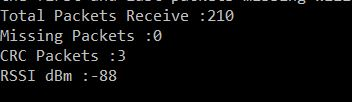

# GOAL: Check the radio communication between two nRF boards

## Segger:
  * **UnZIP** then open `DotBot-firmware` file and open project called `nRF52840dk` with Segger
  * Tx: **build** then **load** `solution Radio test -> project 'Tx'` on the first nRF
  * Rx: **build** then **load** `solution Radio test -> project 'Rx'` on the second nRF
  * Tx_Idle: **build** then **load** `solution Radio test -> project 'Tx Idle'` on the third nRF (you can change the power for your test)

  
    
 ## Python /Conda:
  * **download** in the python file in **dist/scripts/radio_test**
  * **install** serial package `pip install pyserial`
  * **find** the port of your nRF where the RX code is loaded
  * With a text file editor **change** the serialport_rx with the write one
  * **Launch** the script: _dist/scripts/radio_test/radio_test.py	_
  * The script ends when you disconnect the nRF with the Rx code and gives you the result of the radio communication( CRC, Error, number of packets)

  
  